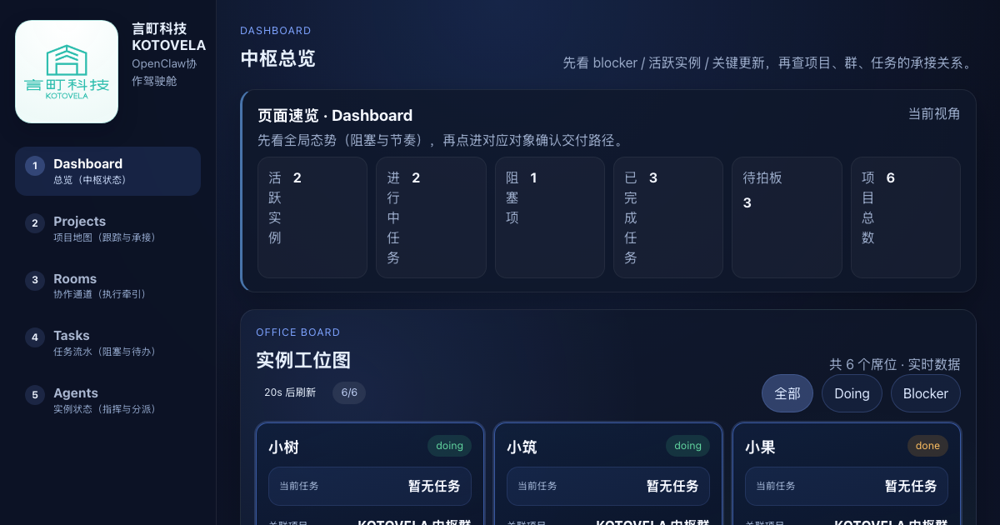
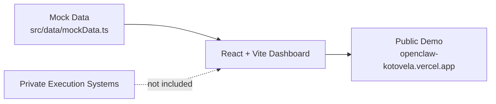
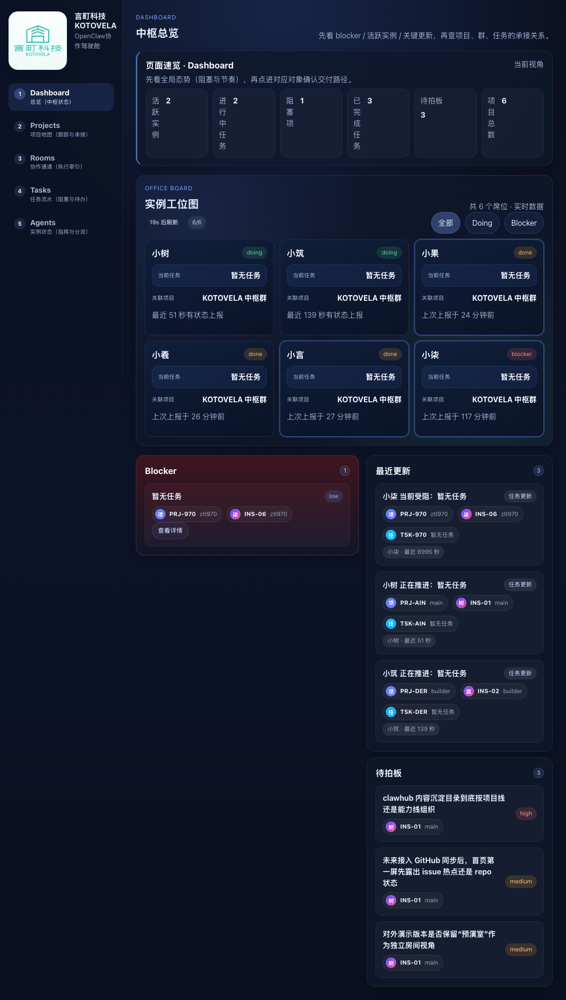
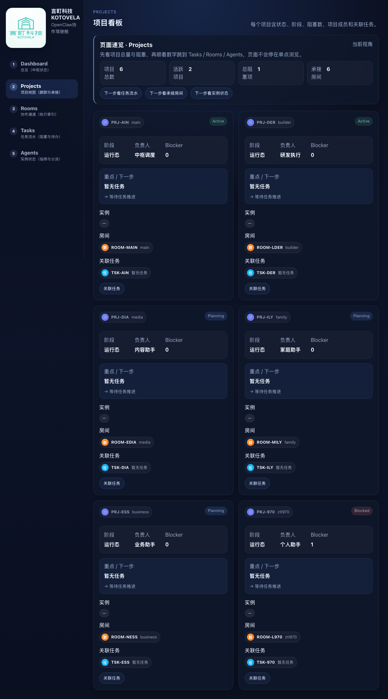
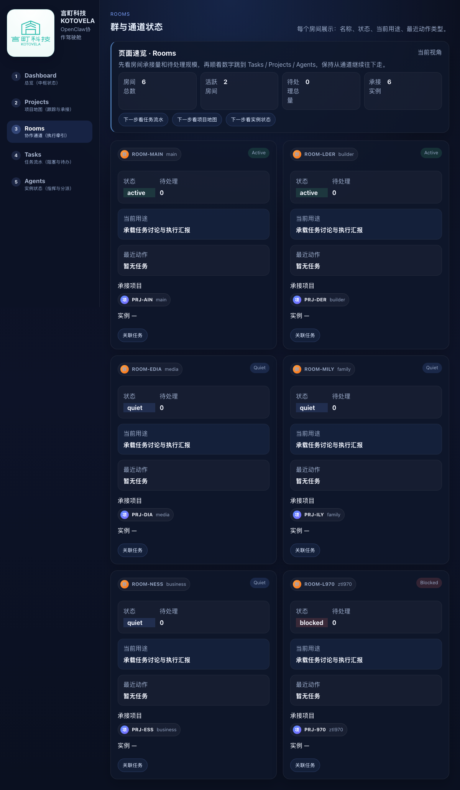
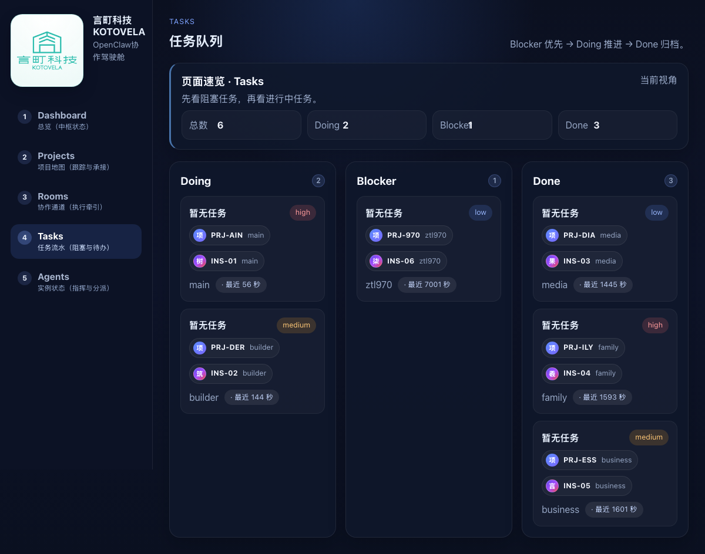
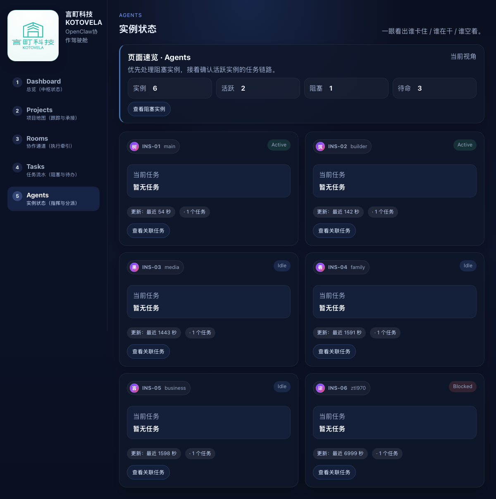

# OpenClaw × Kotovela

**Public-safe / mock-only multi-agent collaboration cockpit showcase.**

[Open the live demo](https://openclaw-kotovela.vercel.app) · [View screenshots](#screenshots) · [Read the architecture](./docs/architecture.md)



This repository is a public showcase for exploring how a multi-agent workbench can make collaboration state visible. It uses synthetic demo data only and is designed to be safe for public review, demos, and portfolio-style sharing.

## Public-safe boundary

### What is included

- React/Vite dashboard showcase for Dashboard, Projects, Rooms, Tasks, and Agents
- Synthetic mock data that illustrates collaboration status, blockers, priorities, and recent updates
- Public-safe screenshots for the live demo experience
- A simple architecture diagram showing the mock-only data flow
- Repository guardrails and CI checks that keep private runtime artifacts out of this public repo

### What is not included

- Production execution logic or live agent runtime code
- Real Feishu, GitHub, workspace, customer, or credential payloads
- Token handling, private webhook logic, or live sync workers
- Private scheduler, consultant, system-control, or evidence-acceptance internals
- Any private local paths or environment-specific deployment secrets

---

## Demo path

Live demo: https://openclaw-kotovela.vercel.app

Recommended walkthrough:

```text
Dashboard → Projects → Rooms → Tasks → Agents
```

The demo is intentionally read-only and mock-only. It is useful for discussing information architecture, visual scanning, and coordination workflows without exposing private execution details.

---

## Architecture preview



See [docs/architecture.md](./docs/architecture.md) for the full public-safe architecture note.

---

## Why this project

When multiple agents collaborate, it becomes difficult to answer simple but critical questions:

- Which agent is currently blocked?
- What is actively moving?
- Where is the work actually happening?
- How are tasks connected to projects and teams?
- What should be handled next?

OpenClaw × Kotovela provides a visual dashboard to make those coordination states easier to scan and discuss.

---

## Screenshots

### Dashboard
See blockers, active agents, and recent updates at a glance.



### Projects
Understand project structure and ownership.



### Rooms
Follow collaboration channels and active contexts.



### Tasks
Inspect mock tasks, priorities, and blocker details.



### Agents
Track agent status and assignments in demo mode.



---

## Quick Start

```bash
git clone https://github.com/guoma970/openclaw-kotovela.git
cd openclaw-kotovela
npm install
npm run dev
```

## Verification

```bash
bash validate_repo.sh
npm run lint
npm run build
```

The same public-safe validation is also enforced by GitHub Actions.

## License

MIT
