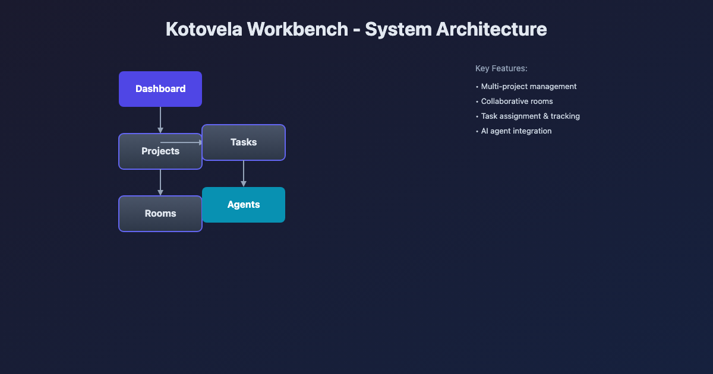

# OpenClaw × Kotovela

A public showcase dashboard for OpenClaw-style agent collaboration.

Track agent status, blockers, tasks, and collaboration flows in one place.

> Public repo scope: this repository intentionally stays on the original open-source showcase baseline. Later internal cockpit enhancements belong in the private `kotovela-hub` codebase, not here.

---

> Designed for fast understanding of multi-agent systems in under 10 seconds.

---


---

## Why this project

When multiple agents collaborate, it becomes difficult to answer simple but critical questions:

- Which agent is currently blocked?
- What is actively moving?
- Where is the work actually happening?
- How are tasks connected to projects and teams?
- What should be handled next?

Without a clear view, coordination becomes slow, fragmented, and reactive.

---

## What this project does

OpenClaw × Kotovela provides a unified dashboard to:

- Visualize agent activity in real time
- Surface blockers and decision points
- Connect tasks, projects, and collaboration channels
- Help you quickly understand and act on the system state

---

## System Overview

Dashboard → Projects → Rooms → Tasks → Agents



- **Dashboard** — global overview of blockers and activity
- **Projects** — project routing and ownership
- **Rooms** — collaboration channels where work happens
- **Tasks** — execution units and blocker tracking
- **Agents** — who is doing what

---

## Screenshots

### Dashboard
See blockers, active agents, and recent updates at a glance  


### Agents
Track agent status and assignments in real time  


### Tasks
Inspect tasks, priorities, and blocker details  


### Projects
Understand project structure and ownership  


### Rooms
Follow collaboration channels and active contexts  


---

## Design Principles

- **Agent-first** — focus on what each agent is doing
- **Blocker-first** — surface what needs attention
- **Linked context** — connect tasks, projects, and rooms
- **Fast scanning** — understand system state in seconds
- **Action-oriented** — reduce path from insight to action

---

## Use Cases

- Multi-agent orchestration dashboards
- AI workflow monitoring
- Team operation dashboards
- Task coordination systems
- Team collaboration visualization

---

## Quick Start

```bash
git clone https://github.com/guoma970/openclaw-kotovela.git
cd openclaw-kotovela
npm install
npm run dev
```

**Mock Data**

This project uses mock data for demonstration:

- `data/agents.json` — agent definitions
- `data/projects.json` — project definitions
- `data/rooms.json` — room definitions
- `data/tasks.json` — task definitions

You can replace them with your own data sources.

---

## Roadmap

- [ ] Lightweight personal control mode (agent-first view)
- [ ] Enhanced blocker visualization
- [ ] Real-time updates (WebSocket / API)
- [ ] Actionable task operations
- [ ] External integrations (GitHub / Feishu / custom APIs)

---

## License

MIT