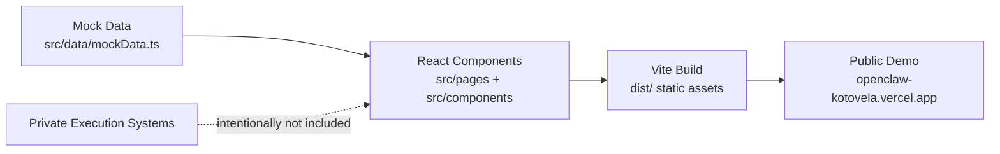

# Public Architecture

OpenClaw × Kotovela is a public-safe, mock-only single-page showcase app. It demonstrates the surface of a multi-agent collaboration cockpit without publishing private execution systems, live payloads, credentials, or environment-specific paths.

## Data flow

## Runtime shape

- Router: `src/App.tsx`
- Layout: `src/layout/AppShell.tsx`
- Mock source: `src/data/mockData.ts`
- Cross-page focus linking: `src/lib/workbenchLinking.ts`
- Demo screenshots: `public/screenshots/`

## Public-safe boundaries

This repository includes:

- Static React/Vite UI code
- Synthetic demo entities for agents, projects, rooms, tasks, and updates
- Public screenshots and documentation
- CI validation for mock-only/public-safe repository hygiene

This repository does not include:

- Production execution logic
- Real credentials, tokens, customer data, or live workspace payloads
- Private webhook, scheduler, sync, or automation workers
- Private local paths or deployment secrets

## Current demo pages

- Dashboard overview with blocker and update summaries
- Projects page for ownership and project state scanning
- Rooms page for collaboration context scanning
- Tasks page for mock task priorities and blockers
- Agents page for demo agent assignments and status
