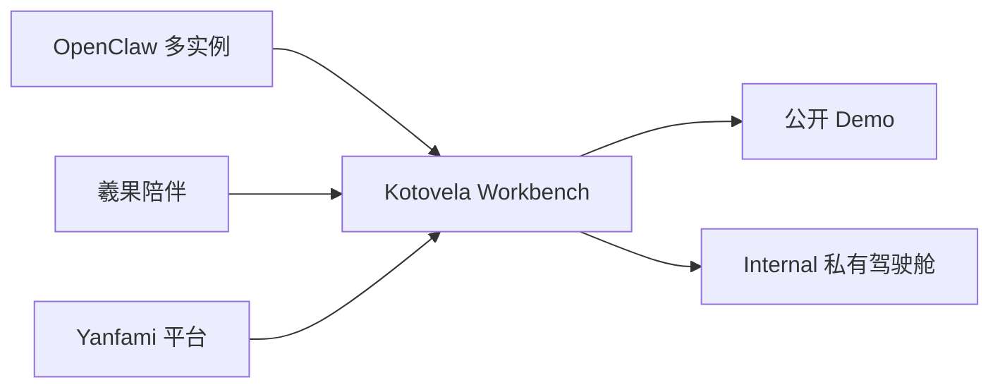
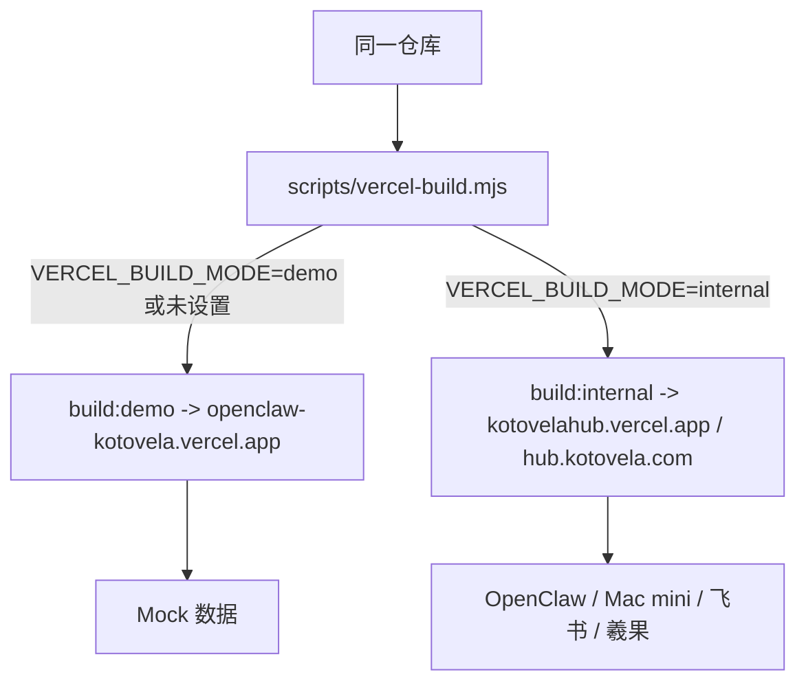
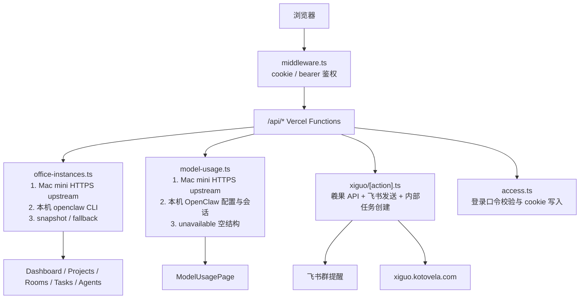
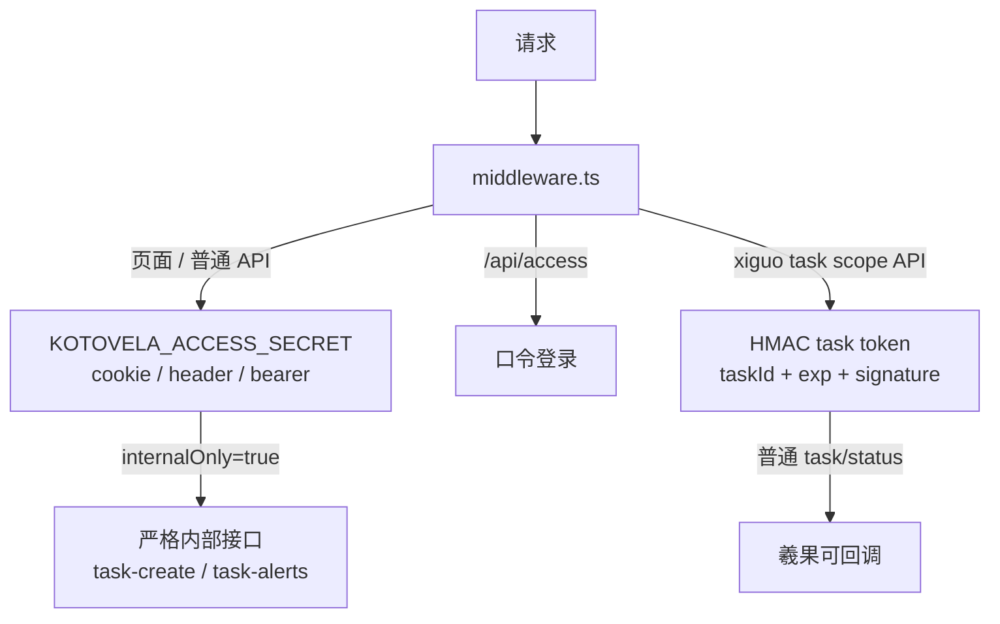
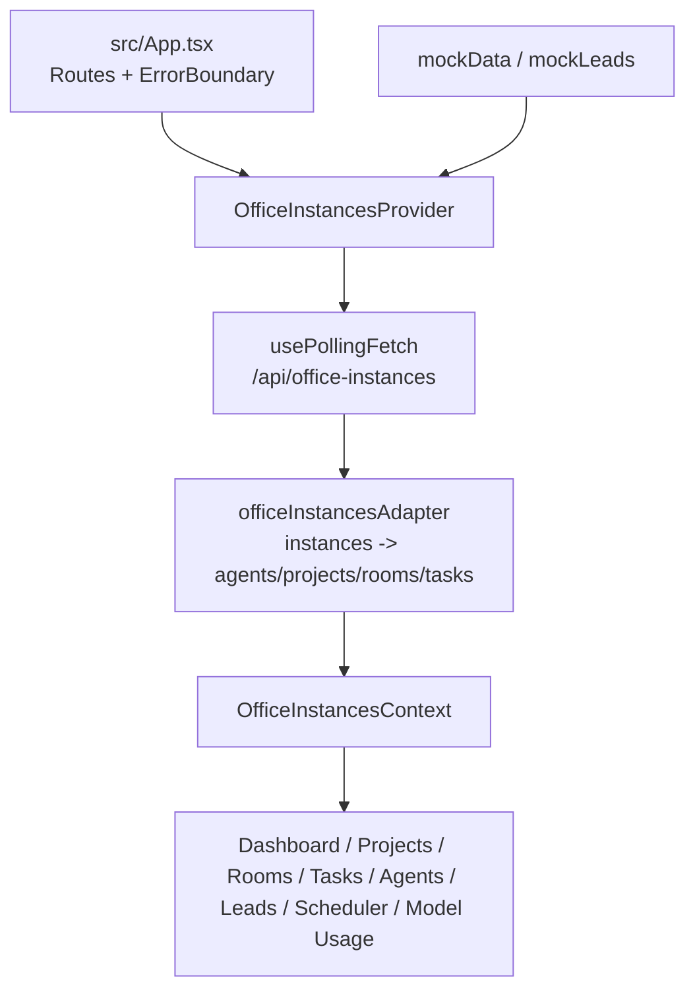
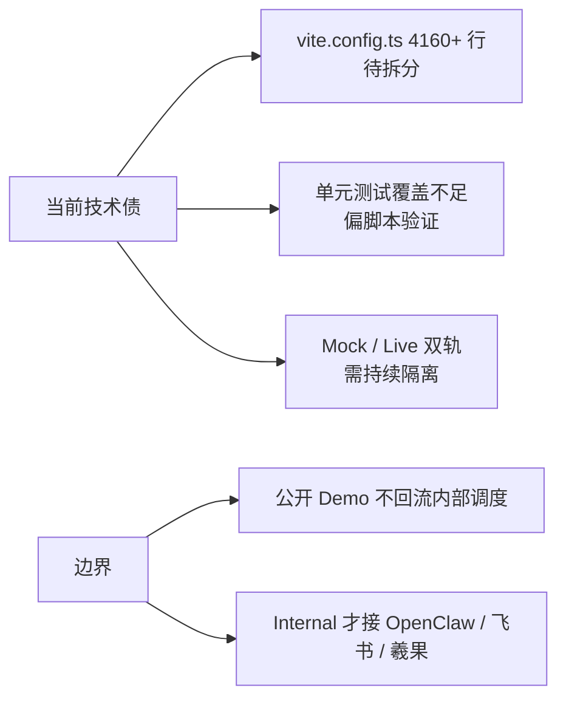

# Kotovela Workbench 架构说明

## 1. 一句话定位

言町驾驶舱（Kotovela Workbench）是连接 OpenClaw 多实例、羲果陪伴与 Yanfami 平台的中枢控制台。它不是单纯展示页，而是把协作者状态、项目/频道/任务、模型用量、飞书作业提醒与执行证据放进同一套前端。公开 Demo 用来讲故事，Internal 用来承载真实个人内部驾驶舱。



## 2. 部署形态

同一仓库输出两种站点。公开 Demo 是 OpenClaw × KOTOVELA，运行在 `openclaw-kotovela.vercel.app`，默认只读 Mock 叙事。内部驾驶舱是 KOTOVELA HUB，运行在 `kotovelahub.vercel.app` 或 `hub.kotovela.com`，读取真实 OpenClaw / 羲果 / 飞书链路。Vercel 通过 `VERCEL_BUILD_MODE` 进入 `scripts/vercel-build.mjs`，再选择 `build:demo` 或 `build:internal`。



## 3. 数据链路

浏览器先经过 `middleware.ts`，用 cookie、`x-kotovela-secret`、`x-kotovela-access-token` 或 Bearer 保护页面和 `/api/*`。前端主要读取同源 Vercel Functions；它们优先走 HTTPS 上游（Mac mini 隧道或只读网关），失败后回退本机 OpenClaw CLI、内部文件适配器或快照。羲果相关 API 还会转发到内部任务接口，并在需要时发送飞书消息。



### 失败兜底顺序

```text
office-instances:
  OFFICE_INSTANCES_UPSTREAM_URL -> fetchOfficeInstancesPayload() -> 500 错误说明

model-usage:
  MODEL_USAGE_UPSTREAM_URL -> fetchModelUsagePayload() -> source=unavailable 空统计

xiguo/[action]:
  task scope token 或 Hub 口令 -> INTERNAL_API_UPSTREAM_ORIGIN -> handleInternalWorkbenchRequest()

front-end officeInstancesContext:
  VITE_DATA_SOURCE=openclaw -> /api/office-instances -> 空/失败时按配置回退 Mock
```

## 4. 鉴权层级

边缘层 `middleware.ts` 负责站点级保护，登录成功后由 `api/access.ts` 写入 `kotovela_access` HttpOnly cookie。服务端普通内部接口使用 `hasKotovelaAccess`：没有主口令时本地开发可放行，配置后检查 Header、Bearer 或 cookie。羲果 task scope token 使用 HMAC-SHA256，默认 3 天 TTL，让羲果网页只凭单个任务链接回调，不共享主密钥；`internalOnly: true` 相当于严格模式，只允许 Hub 主访问凭据。



## 5. 环境变量速查表

环境变量分三层：前端只吃 `VITE_*` 这类可公开配置；Vercel Functions 吃上游 URL、Token、飞书与羲果密钥；Mac mini 常驻服务吃本机 OpenClaw 和 API 保护变量。真实密钥不进仓库，示例值只写占位符。缺少上游时，读接口尽量降级；缺少写入密钥时，飞书/羲果发送会 fail-closed。

| 变量 | 用途 | 消费侧 | 必填 | 示例 |
| --- | --- | --- | --- | --- |
| `KOTOVELA_ACCESS_SECRET` | 内部驾驶舱访问口令、API 主密钥、task link 备选签名源 | middleware / Vercel API / Mac mini | Internal 必填 | `<access-passphrase>` |
| `KOTOVELA_ACCESS_REQUIRED` | 即使没有口令也强制启用访问保护 | middleware | 可选 | `1` |
| `KOTOVELA_PUBLIC_ORIGIN` | 生成回到驾驶舱的公网链接 | server/xiguoTaskAccess | 可选 | `https://hub.kotovela.com` |
| `KOTOVELA_CLOUDFLARE_HOSTNAME` | Cloudflare Tunnel 固定域名 | tunnel scripts | 可选 | `office-api.kotovela.com` |
| `KOTOVELA_CLOUDFLARE_SERVICE_URL` | Tunnel 指向的本机服务 | tunnel scripts | 可选 | `http://127.0.0.1:8791` |
| `KOTOVELA_CLOUDFLARE_TUNNEL_TOKEN` | Cloudflare Tunnel token | tunnel scripts | 可选 | `<cloudflare-token>` |
| `KOTOVELA_CLOUDFLARE_TUNNEL_NAME` | Tunnel 名称 | tunnel scripts | 可选 | `kotovela-office-readonly` |
| `KOTOVELA_CLOUDFLARE_TUNNEL_ENV_FILE` | Tunnel launchd 环境文件路径 | tunnel scripts | 可选 | `~/.config/kotovela/cloudflare-readonly-tunnel.env` |
| `KOTOVELA_CLOUDFLARE_TUNNEL_PROTOCOL` | cloudflared 协议 | tunnel scripts | 可选 | `http2` |
| `KOTOVELA_CLOUDFLARE_OVERWRITE_DNS` | 是否覆盖 DNS 记录 | tunnel bootstrap | 可选 | `1` |
| `OFFICE_INSTANCES_UPSTREAM_URL` | Vercel 读取实例状态的 HTTPS 上游 | api/office-instances | Internal 推荐 | `https://office-api.example.com/api/office-instances` |
| `OFFICE_INSTANCES_UPSTREAM_TOKEN` | 调用实例状态上游的 Bearer token | api/office-instances | 上游启用 token 时必填 | `<office-api-token>` |
| `OFFICE_INSTANCES_UPSTREAM_ALLOW_HOSTS` | 上游 host 白名单，降低 SSRF 风险 | api/office-instances / internal proxy | 生产推荐 | `office-api.example.com` |
| `MODEL_USAGE_UPSTREAM_URL` | Vercel 读取模型用量的 HTTPS 上游 | api/model-usage | Internal 推荐 | `https://office-api.example.com/api/model-usage` |
| `MODEL_USAGE_UPSTREAM_TOKEN` | 调用模型用量上游的 Bearer token | api/model-usage | 上游启用 token 时必填 | `<office-api-token>` |
| `MODEL_USAGE_UPSTREAM_ALLOW_HOSTS` | 模型用量上游 host 白名单 | api/model-usage / internal proxy | 生产推荐 | `office-api.example.com` |
| `MODEL_USAGE_CACHE_MS` | Mac mini 模型用量缓存时间 | scripts/office-api-server.ts | 可选 | `60000` |
| `XIGUO_API_URL` | 羲果陪伴接收作业派发的接口 | server/xiugDispatch | 派发必填 | `https://xiguo-api.example.com/api/tasks/dispatch` |
| `XIGUO_API_KEY` | 羲果 API 密钥，也可作 task link 备选签名源 | server/xiugDispatch / xiguoTaskAccess | 派发必填 | `<xiguo-api-key>` |
| `XIGUO_LINK_SECRET` | 飞书作业链接 HMAC 签名密钥 | server/xiguoTaskAccess | 生产推荐 | `<xiguo-link-secret>` |
| `XIGUO_TASK_LINK_TTL_SECONDS` | 作业链接有效期，默认 3 天 | server/xiguoTaskAccess | 可选 | `259200` |
| `XIGUO_ALLOWED_ORIGIN` | 允许羲果网页跨域调用 Hub task API | server/xiguoApiRoute | 生产推荐 | `https://xiguo.kotovela.com` |
| `FEISHU_APP_ID` | 飞书应用 ID，用于 sendMessage | server/xiugDispatch | 群消息必填 | `<feishu-app-id>` |
| `FEISHU_APP_SECRET` | 飞书应用密钥，用于 tenant access token | server/xiugDispatch | 群消息必填 | `<feishu-app-secret>` |
| `FEISHU_OPEN_API_BASE_URL` | 飞书 OpenAPI 域名，测试可指向 mock server | server/xiugDispatch | 可选 | `https://open.feishu.cn` |
| `FEISHU_STUDY_COLLAB_CHAT_ID` | 果果学习协同群 chat_id，测试派发目标 | server/xiugDispatch | 测试提醒必填 | `<your_collab_chat_id>` |
| `FEISHU_STUDY_ASSIGN_CHAT_ID` | 果果学习布置群 chat_id，正式派发目标 | server/xiugDispatch | 正式提醒必填 | `<your_assign_chat_id>` |
| `FEISHU_STUDY_CHAT_ID` | 旧配置兼容，作为布置群 fallback | server/xiugDispatch | 可选 | `<legacy_chat_id>` |
| `FEISHU_STUDY_TEST_CHAT_ID` | 测试群 fallback | server/xiugDispatch | 可选 | `<test_chat_id>` |
| `FEISHU_STUDY_WEBHOOK` | 旧 webhook 兼容 | server/xiugDispatch | 可选 | `https://open.feishu.cn/open-apis/bot/v2/hook/<token>` |
| `FEISHU_STUDY_COLLAB_WEBHOOK` | 协同群 webhook fallback | server/xiugDispatch | 可选 | `<collab-webhook>` |
| `FEISHU_STUDY_ASSIGN_WEBHOOK` | 布置群 webhook fallback | server/xiugDispatch | 可选 | `<assign-webhook>` |
| `FEISHU_STUDY_TEST_WEBHOOK` | 测试 webhook fallback | server/xiugDispatch | 可选 | `<test-webhook>` |
| `FEISHU_STUDY_ACCOUNT` | OpenClaw CLI 发送学习消息时使用的账号 | server/xiugDispatch | 可选 | `family` |
| `OPENCLAW_BIN` | openclaw CLI 路径 | server/modelUsage / xiugDispatch | 本机读取推荐 | `/Users/you/.npm-global/bin/openclaw` |
| `OPENCLAW_HOME` | OpenClaw 配置与 agents 根目录 | server/modelUsage | 本机读取推荐 | `/Users/you/.openclaw` |
| `OPENCLAW_PROJECT_ROOT` | 项目根目录 fallback | vite.config / internalWorkbench | 可选 | `/path/to/kotovela-workbench` |
| `OPENCLAW_RUNNER_ROOT` | 内部任务运行数据目录 | vite.config / internalWorkbench | 可选 | `data/openclaw-runner` |
| `OPENCLAW_STATUS_TIMEOUT_MS` | `openclaw models status` 超时时间 | server/modelUsage | 可选 | `15000` |
| `OPENCLAW_FEISHU_WEBHOOK_URL` | 通用 OpenClaw 飞书 webhook fallback | vite.config | 可选 | `<webhook-url>` |
| `OPENCLAW_STUDY_MESSAGE_API_URL` | OpenClaw 学习消息中继接口 | server/xiugDispatch | 可选 | `https://office-api.example.com/api/xiguo-study-message` |
| `OPENCLAW_STUDY_MESSAGE_TOKEN` | 学习消息中继 token | server/xiugDispatch | 可选 | `<relay-token>` |

### 构建与前端相关变量

```text
VERCEL_BUILD_MODE=demo|internal
VITE_MODE=opensource|internal
VITE_DATA_SOURCE=mock|openclaw
VITE_OFFICE_INSTANCES_API_PATH=/api/office-instances
VITE_POLLING_ENABLED=true
VITE_POLLING_INTERVAL_MS=5000
VITE_VISIBILITY_REFRESH=true
VITE_FALLBACK_TO_MOCK=true
VITE_STALE_MS=30000
```

## 6. 前端结构

前端是 Vite + React 单页应用。`src/App.tsx` 定义路由表，并用 `OfficeInstancesProvider` 包住所有页面；`src/data/officeInstancesContext.tsx` 负责轮询 `/api/office-instances`，再通过 adapter 推导协作者、项目、频道、任务和更新流。`src/pages/*` 只消费统一后的页面数据，`src/data/*` 负责 mock、同步、diff、fallback 与链接关系。



### 路由速查

```text
/                    -> DashboardPage
/projects             -> ProjectsPage
/rooms                -> RoomsPage
/tasks                -> TasksPage
/agents               -> AgentsPage
/leads                -> LeadsPage
/scheduler            -> AutoTasksPage
/consultants          -> ConsultantsPage
/model-usage          -> ModelUsagePage
/system-control       -> SystemControlPage
/evidence-acceptance  -> EvidenceAcceptancePage
```

## 7. 已知技术债与边界

当前系统已从 v1 展示页演进为内部执行台，但仍有边界：`vite.config.ts` 超过 4000 行，混合开发接口与业务规则，后续应拆成 server 模块；单元测试覆盖不足，主要依赖稳定化脚本与构建；Mock 与真实 dev API 双轨仍并存，公开 Demo 必须避免接入真实内部能力。更多拆分应按 issue/任务单小步推进。


